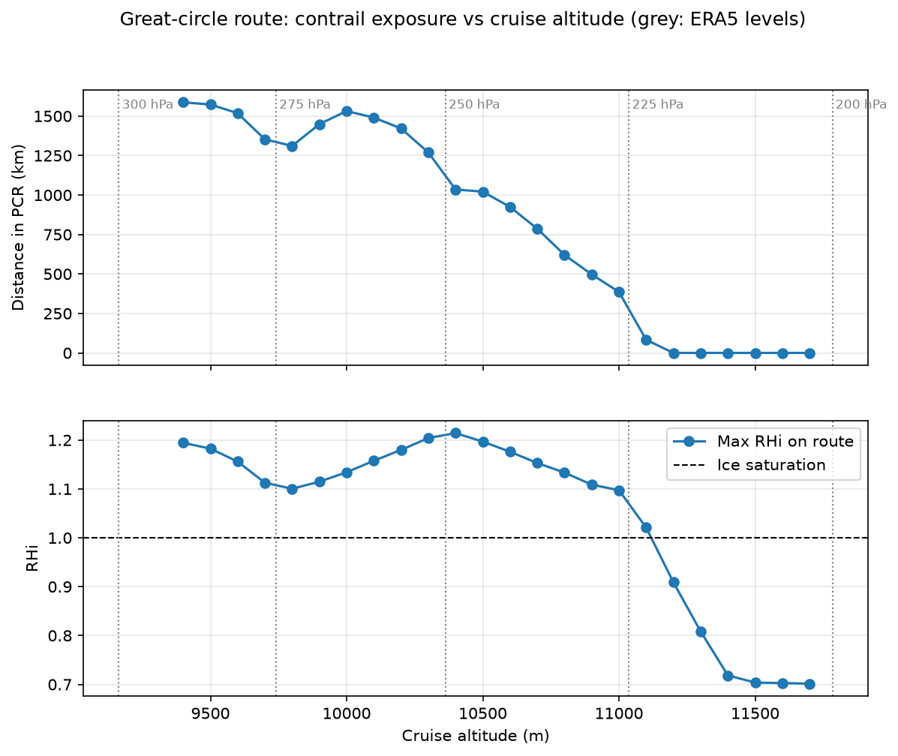
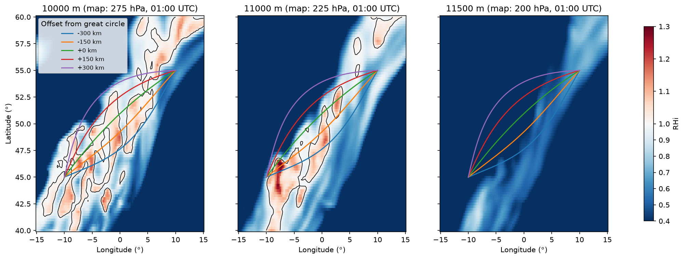

# robust-contrail-routing

**How should an aircraft's route be chosen so that it avoids creating long-lasting contrails, without costing too much extra, when the weather data behind that choice is uncertain?**

This project studies that question computationally, using real ERA5 atmospheric reanalysis data and the open-source contrail model [pycontrails](https://py.contrails.org). It is being developed in stages, from basic contrail modelling towards contrail-aware and, eventually, uncertainty-robust route selection.

> **Status:** Sessions 1–3 complete (modelling baseline, along-track variation, candidate routes and altitude sweep). Next: defining a routing objective that trades contrail exposure against operational cost.

---

## Why this matters

Persistent contrails, the line-shaped clouds that sometimes spread and last for hours behind aircraft, are thought to be one of the largest contributors to aviation's climate effect. They form only in specific regions of cold, ice-supersaturated air, which are often thin and patchy. That means small changes to a flight's altitude or path can sometimes avoid them.

Two complications make this an engineering decision problem rather than a pure physics one:

1. **Avoidance has a cost.** Deviating from the planned route usually means extra distance, extra fuel and extra CO₂.
2. **The atmosphere is uncertain.** Weather models, including ERA5, are known to have difficulty representing ice supersaturation. A route that appears to avoid contrails on paper may not do so in reality.

Real-world trials (e.g. Google Research, Breakthrough Energy and American Airlines) have shown that contrail avoidance can work in operation. Reliable prediction of ice-supersaturated regions remains one of the main open problems, and that is the problem this project's "robust" stage addresses.

---

## Headline result (Session 3)

For a synthetic flight from (−10°, 45°) to (10°, 55°) on 2022-03-01, departing 00:00 UTC:

| Option | Extra distance | Distance flown in persistent-contrail conditions |
|---|---|---|
| Great-circle route at 11,000 m (reference) | 0 km | **386 km** (21% of route) |
| 150 km deviation to the north-west, 11,000 m | +30 km (+1.7%) | **69 km** |
| 150 km deviation to the south-east, 11,000 m | +30 km (+1.7%) | **925 km** |
| Great-circle route at 10,000 m | 0 km | **1,532 km** (85%) |
| Great-circle route at 11,500 m | 0 km | **0 km** |

- **Altitude was the strongest lever.** The supersaturated layer ended just below the tropopause, so climbing a few hundred metres removed all exposure in this case.
- **Lateral deviation helped only towards the dry side** of a long SW–NE band of supersaturated air. Deviating the other way more than doubled exposure.
- **The exact cut-off altitude is uncertain.** It falls between two ERA5 pressure levels, where values are interpolated. This is precisely the kind of uncertainty the later robust-routing stage is designed to handle.





---

## Method

```
synthetic aircraft trajectory
  → ERA5 temperature and humidity (200–300 hPa) interpolated along the path
  → pycontrails PCR model:
       Schmidt–Appleman criterion (SAC): can a contrail form?
       ice supersaturation (ISSR, RHi > 1): can it persist?
       PCR = SAC and ISSR
  → contrail-exposure metrics per route (km and fraction flown in PCR)
  → comparison against an operational-cost proxy (extra distance)
```

**Data:** ERA5 reanalysis via pycontrails' `ERA5ARCO` (Google's analysis-ready ERA5 store), temperature and specific humidity on 200, 225, 250, 275 and 300 hPa, hourly.

**Routes (Session 3):** a fixed, symmetric family defined before any results were seen, so routes were not tuned to the data:
- lateral: the great circle plus smooth deviations of ±150 km and ±300 km at mid-route
- vertical: 10,000, 11,000 and 11,500 m, plus a 100 m-step altitude sweep from 9,400 to 11,700 m
- constant cruise speed of 230 m/s, no wind, constant altitude per route

**Key metric:** distance flown in persistent-contrail (PCR) conditions. This is used as a *proxy* for contrail climate impact. It indicates where persistent contrails can form, not how much warming they cause.

---

## Sessions so far

| Session | Question | Main finding |
|---|---|---|
| 1 | Does the modelling pipeline work? | 20-point flight over the English Channel: SAC met everywhere, no ice supersaturation, PCR = 0. A valid baseline. |
| 2 | Does PCR vary along a trajectory? | Longer flight: 20 of 121 points in PCR, in one main segment, plus one marginal point. Many points sat within a few percent of saturation, a first sign of sensitivity to humidity error. |
| 3 | How much does route choice change exposure? | Altitude was decisive and lateral deviation helped only towards the dry side. See the headline result above. |

---

## Data quality and corrections

These are recorded deliberately; catching and documenting them is part of the work.

- **Missing ERA5 hour (Session 2).** The first data load returned all-NaN fields at 04:00 UTC, which silently affected 40 flight points. An explicit NaN check caught it. The corrupted cache file was regenerated and the results verified unchanged elsewhere. A NaN guard now runs before every evaluation.
- **Humidity variable (Session 1).** pycontrails' `rh` output is relative humidity over *liquid water*. Ice supersaturation is defined over *ice* (RHi). RHi is now computed explicitly and validated against the model's ISSR flag.
- **Flight speed (Session 2 → 3).** Session 2's synthetic flight was unrealistically slow (~84 m/s). At a realistic 230 m/s, exposure along the same line changed from 317 km to 800 km, because the flight met the atmosphere at different times.
- **Route geometry (Session 3).** The first route family used straight lines on a flat map, which are not the shortest path. It was rebuilt around the great circle, and the original results are kept as `*_v1_flatframe` files.
- **Humidity scaling.** ERA5 is known to under-represent ice supersaturation, and pycontrails recommends humidity scaling for ECMWF data. The baseline is deliberately unscaled. Scaling will be introduced as part of the uncertainty analysis, not used to tune results.

---

## Limitations

- One date, one departure time, one synthetic city pair
- No wind, no climb or descent, constant cruise altitude per route
- Operational cost is currently extra distance only. The fuel cost of flying at a non-optimal altitude is not yet modelled, so altitude changes currently appear "free".
- PCR is a proxy for contrail impact, not a radiative-forcing or climate calculation
- Vertical resolution near the tropopause is limited to the five ERA5 pressure levels loaded

---

## Roadmap

- [x] Persistent-contrail modelling baseline
- [x] Spatial and temporal variation along a trajectory
- [x] Candidate routes and contrail-exposure metrics
- [ ] Routing objective: contrail exposure vs operational cost, including an altitude/fuel penalty
- [ ] Deterministic contrail-aware route comparison
- [ ] Atmospheric uncertainty: humidity scaling and perturbations, finer vertical resolution
- [ ] Robust routing: routes that remain good across plausible atmospheric scenarios
- [ ] Comparison of deterministic and robust route choices, and trade-off analysis

---

## Repository structure

```
notebooks/
  01_pycontrails_hello_world.ipynb   Sessions 1–2: baseline PCR, along-track variation
  02_candidate_routes.ipynb          Session 3: field maps, route family, altitude sweep
results/
  session2_*.csv                     along-track results and PCR segments
  session3_*.csv                     route metrics, along-track results, altitude sweep
  figures/                           saved figures used in this README
```

---

## Reproducing

Developed with Python 3.13 on Windows.

```bash
python -m venv .venv
.venv\Scripts\python.exe -m pip install -r requirements.txt
.venv\Scripts\python.exe -m ipykernel install --user --name robust-contrail-routing --display-name "Python (robust-contrail-routing)"
```

Then open the notebooks in Jupyter with the `Python (robust-contrail-routing)` kernel and run them top to bottom.

Notes:
- The first ERA5 load downloads data and converts it from ERA5's 137 model levels to pressure levels, one hour at a time. This takes several minutes and is cached on disk afterwards. Keep the disk cache enabled. Loading without it attempts the whole conversion in memory and can exceed the RAM of a typical laptop.
- `gcsfs` is pinned to `2025.9.0` because newer versions caused an authentication error with anonymous access to the ERA5 store.

---

## Acknowledgements

- [pycontrails](https://github.com/contrailcirrus/pycontrails), developed by Breakthrough Energy and Imperial College London
- ERA5 reanalysis: Hersbach et al. (2020), Copernicus Climate Change Service. Contains modified Copernicus Climate Change Service information.
- ERA5 accessed through Google's Analysis-Ready, Cloud-Optimized (ARCO) ERA5 dataset

---

## Author

Baris Unluyildiz, BEng Aerospace Engineering, University of Manchester
[LinkedIn](https://www.linkedin.com/in/baris-unluyildiz/)
